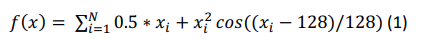
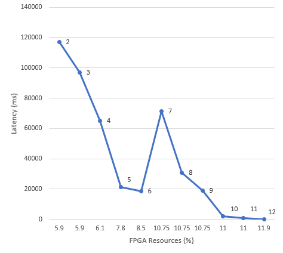

# Digital_System_Design
This reposistory includes code from coursework done for the module Digital System Design EE3.05 taught at Imperial College London by Prof. Christos Bouganis. The goal of the module was to familiarize students FPGA's, CPU architecture and HW/SW partitioning. Our objective in the coursework was to accelerate an application through reconfigurable HW.

In collaboration with Omar Tahir (Talndir)

## Specifications

The code given in this repository describes the steps taken to accelerate the function shown below on a FPGA with the NIOSII embedded processor. We have used the Intel FPGA Embedded Development Suite Quartus 18.1.

The different tasks describe our design process to get to our final result. Which was a latency of 219 ms, Error of 0.0033% and used FPGA resources of 11.9%. The results of the configurations we have used to get there are shown in the figure below.

## Structure

├── Pictures
     ├── DSD_formula.png              # Evaluated formula
     ├── DSDpt3.png                   # Used configurations
     ├── DSDRecap.png                 # Used configurations
     ├── Results-DSD3.png             # Results of all the different configurations
     └── sincos_cordic.png            # Simulation (Modelsim) of our Cordic algorithm
├── ip/DSD_Material_Students          # Ip's for testing
     └── system_template_de1_soc
├── Task2/DSD_Material_Students       # Computing a simple function
     └── system_template_de1_soc
├── Task3/DSD_Material_Students       # Storing the program and Data on External Memories
     └── system_template_de1_soc
├── Task4/DSD_Material_Students       # Evaluate a More Complex Mathematical Expression
     └── system_template_de1_soc
├── Task5/DSD_Material_Students       # Add Multiplier Support
     └── system_template_de1_soc
├── Task6/DSD_Material_Students       # Add Hardware Floating-Point Units
     └── system_template_de1_soc
├── Task7/DSD_Material_Students       # Add Dedicated Hardware Block to compute the inner part of the arithmic expression (Cordic)
     └── system_template_de1_soc
├── Task8/DSD_Material_Students       # Add Dedicated Hardware Block to compute the arithmic expression
     └── system_template_de1_soc
└── Readme.md
